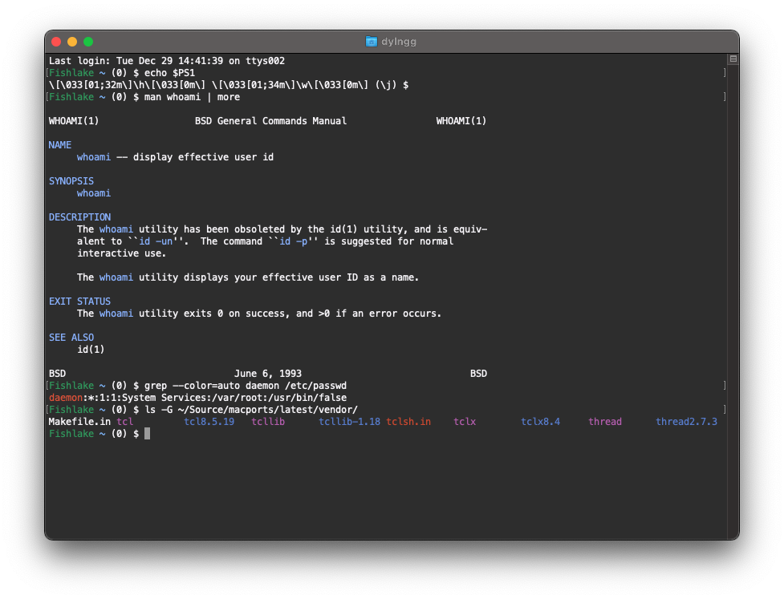
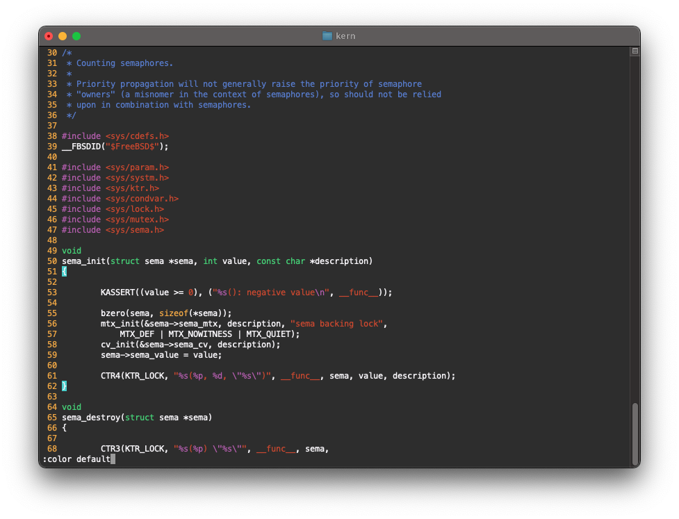
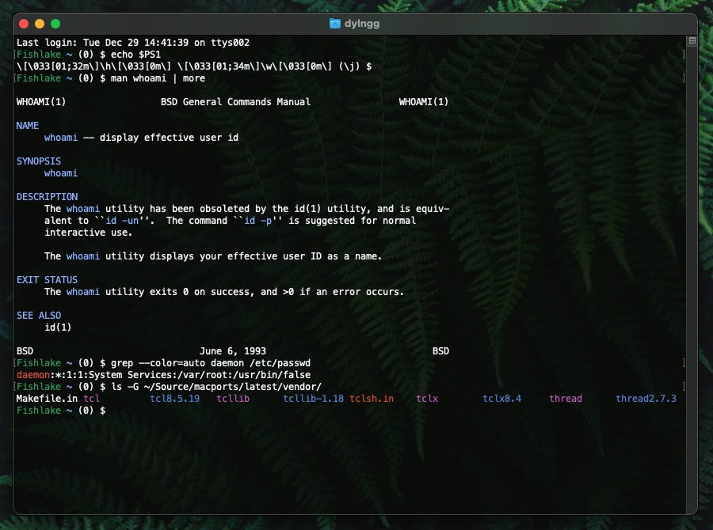
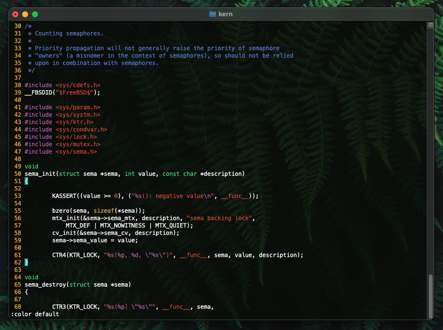
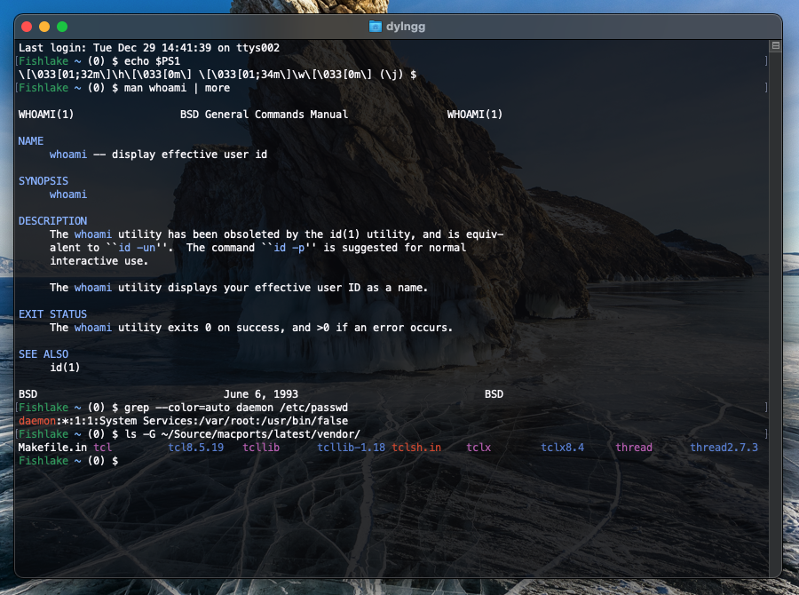
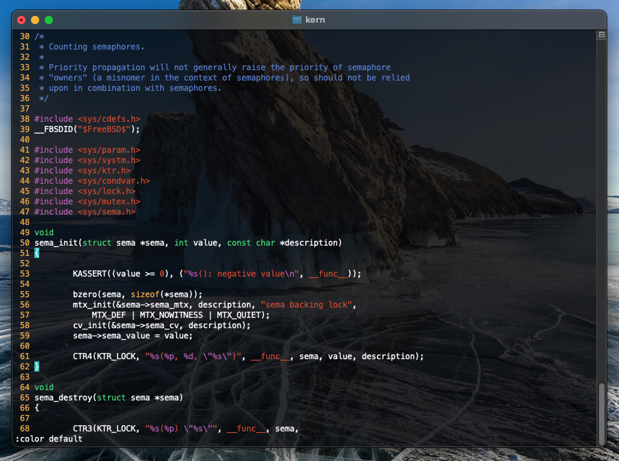
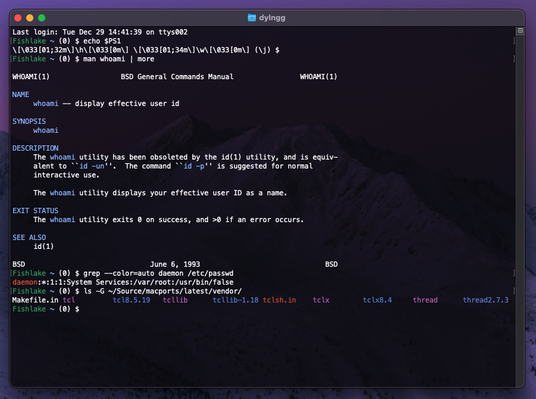
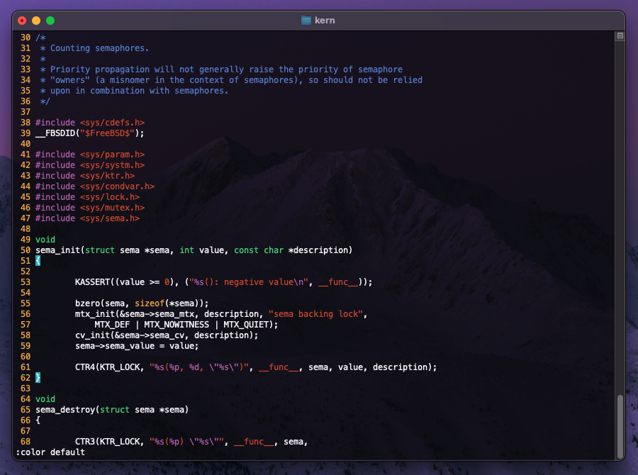
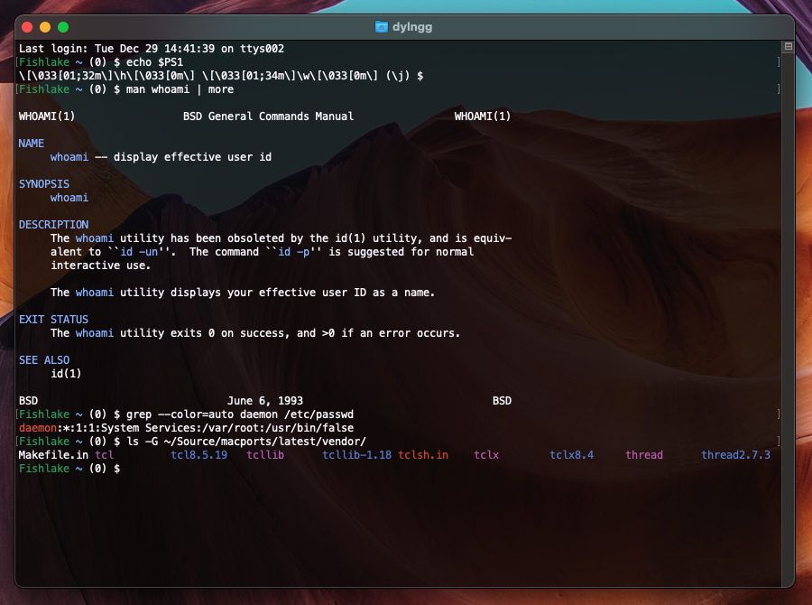
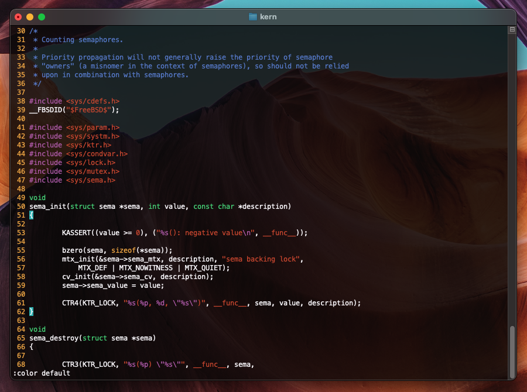

# Natural MacOS Terminal Themes

A collection of natural-looking Terminal themes to match the look and feel of MacOS.

There are five wallpapers: a default called "Natural" and four background tinted variations of that listed below.

## Screenshots

## Tinted Variations

### Natural Forest (green)

#### Screenshots

### Natural Ice (blue)

#### Screenshots

### Natural Aurora (purple)

#### Screenshots

### Natural Sunset (orange)

#### Screenshots

### Importing

Open up a Terminal, select Terminal -> Preferences in the menu bar. In the Profiles section at the bottom of the profiles list, click the more button (`(...)`), then Import.

### Wallpapers

The wallpapers shown in the tinted variants were pulled from [ElementaryOS](https://elementary.io)'s [wallpaper repo](https://github.com/elementary/wallpapers/tree/7656a8cf14326bbe29a7b6cd206514093bedbaba).

